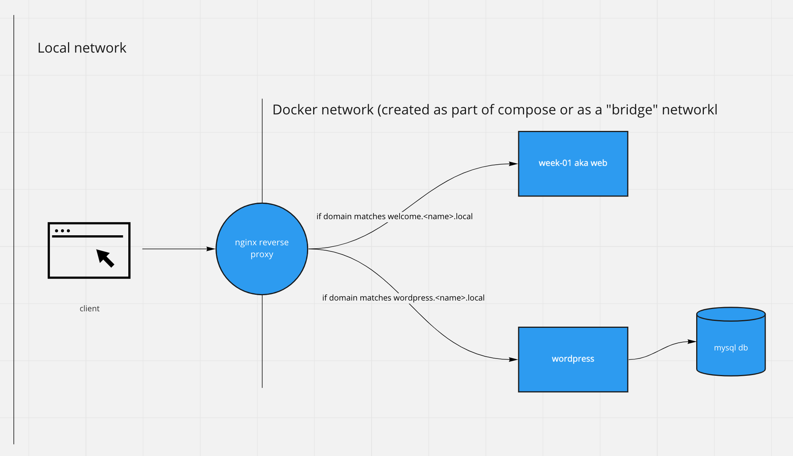

# Docker Compose and a Small VPC

Let's create an instance of our welcome page, wordpress, and a MySQL db all behind an Nginx powered proxy.

Topics included:

- Docker Compose
- Docker Volumes
- Virtual Private Cloud (sort of)

## What we're building



## What this does

This mimics a real world thing we call a Virtual Private Cloud. The welcome page app, wordpress, and the MySQL database are contained in their own network and they are only accessible through specific routes we will create like `blog.{name}.local`.

## Open a terminal

And make sure you are in the example-02 directory.

```bash
~/code/docker-and-kubernetes-intro $ cd example-02
~/code/docker-and-kubernetes-intro/example-02 $
```

## Run the build script

This will build the docker image for example 01 to make sure it is created and tagged for this example.

```bash
$ sh ./build-example-01.sh
```

## Open docker-compose.yml

```docker
version: "3.9"

services:
  # container for our example-01 app
  # web:

  # container for database backing wordpress
  # wordpress_db:

  # container for wordpress server
  # wordpress:

  # container for reverse proxy server
  # reverse-proxy:
# volumes:

```

## Add our welcome page app

```docker
  web:
    image: example-01:latest
    restart: always
    ports:
      - 9001:9001
```

## Test the welcome page app

```bash
docker compose up
```

Head to http://locahost:9001

## Add wordpress and MySQL

```docker
  # This configures the database for the Wordpress site
  wordpress_db:
    image: mysql:5.7
    platform: linux/x86_64
    volumes:
      - db_data:/var/lib/mysql
    restart: always
    environment:
      MYSQL_ROOT_PASSWORD: wordpresspass
      MYSQL_DATABASE: ${DB_NAME}
      MYSQL_USER: ${DB_USER}
      MYSQL_PASSWORD: ${DB_PASS}
  # This configures the wordpress application itself
  wordpress:
    # This tells Docker to only start wordpress after "wordpress_db" is started
    depends_on:
      - wordpress_db
    image: wordpress:latest
    volumes:
      - wordpress_data:/var/www/html
    ports:
      - 8000:80
    restart: always
    environment:
      WORDPRESS_DB_HOST: wordpress_db
      WORDPRESS_DB_NAME: ${DB_NAME}
      WORDPRESS_DB_USER: ${DB_USER}
      WORDPRESS_DB_PASSWORD: ${DB_PASS}
```

## Add reverse proxy via Nginx Proxy Manager

```docker
  reverse-proxy:
    image: jc21/nginx-proxy-manager:latest
    restart: always
    ports:
      - 80:80
      - 81:81
    volumes:
      - rp_data:/data
      - le_data:/etc/letsencrypt
```

## Add docker volumes to cover each of the above

```docker
volumes:
  db_data: {}
  wordpress_data: {}
  le_data: {}
  rp_data: {}
```

## Set up proxies and local domains

Head to http://localhost:81 to set up Nginx Proxy Manager.

Add two proxy hosts:

Welcome page app
- Domain name: welcome.{name}.local
- Forward host/IP: web
- Port: 80

Wordpress
- Domain name: blog.{name}.local
- Forward host/IP: wordpress
- Port: 80

Open your `/etc/hosts` file.

```bash
open /etc/hosts -a Sublime\ Text
```

Add the following lines to the bottom, make sure the space in between is a tab:

```
127.0.0.1	welcome.{name}.local
127.0.0.1	blog.{name}.local
```

## Fix a Wordpress specific issue

Head to http://blog.{name}.local
Install and configure wordpress per the instructions
Head to settings

Change the `Wordpress address` and `Site address` to remove the `:8000` at the end. When you click save, you will land at a `502 Bad Gateway` page - this is expected.

Note: if you arrive at the settings page and no `:8000` exists at the end of the URL, then that is ok. This step can be skipped in that case.

## Correct the wordpress proxy

Head to http://localhost:81

Change the port on the wordpress proxy to be 80 instead of 8000

## Hide all non reverse proxy services

Kill the curent docker compose instance and comment out the ports on the web and wordpress container

```docker
  web:
    ...
    # ports:
    #   - 9001:9001
  ...
  wordpress:
    ...
    # ports:
    #   - 8000:80
```

## Start everything up

`docker compose up`

You should now have two apps running - your welcome page app, and Wordpress. Both of these should only be accessible behind their custom domain configured on your machine and not through localhost using ports.